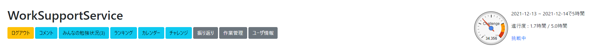

# どんなサービスか

- ユーザの日々の作業を記録するライフログ
- [ゲストログイン](https://wsapp.cs.kobe-u.ac.jp/WorkSupportService/guest/logs)

# サービスの目的

## 建前

- Gamification を含む様々な機能でユーザの作業に対するモチベーションの向上を図る

## 本質

- ユーザの継続的なデータ収集を目的とするサービスの一般的な例として用いる

# サービスの使い方

## アカウント作成・更新

### 1. アクセス

- <a href="https://wsapp.cs.kobe-u.ac.jp/WorkSupportService" rel="nofollow">WorkSupportService</a>にアクセス

### 2. 新規登録

- 登録済みの方は 3 へ

- 新規登録 -&gt;

- 希望する ID(半角英数字)
- ニックネーム

  - 情報を公開する場合にほかのユーザから見られる

- E メールアドレス

  - 今のところ特に使っていないのでメールが送られてくることはない

- <a href="https://wsapp.cs.kobe-u.ac.jp/ToDoApp" rel="nofollow">ToDo 管理サービス</a>のユーザ ID

  - ミーティングログ生成機能などに使用,
  - 研究室の自分の ID のはず

- 情報を公開するにチェック
  - できれば公開してほしいが、最悪非公開でも OK

* 登録する -&gt; 確認 -&gt; 登録する -&gt; 戻る

### 3. ログイン

- uid を入力 -&gt; ログイン

### 既にアカウントを持っていた方

- ユーザ情報 -&gt;

- <a href="https://wsapp.cs.kobe-u.ac.jp/ToDoApp" rel="nofollow">ToDo 管理サービス</a>のユーザ ID

  - ミーティングログ生成機能などに使用,
  - 研究室の自分の ID のはず

- 情報を公開するにチェック
  - できれば公開してほしいが、最悪非公開でも OK

* 更新する -&gt; 確認 -&gt; 更新する -&gt; 戻る -&gt; 戻る

## ログの記録

- 作業をする際に、該当する作業をクリック
  - 現在行っている作業が緑色になる

### 該当する作業がない場合

- 作業管理 -&gt; 追加

- 希望する ID(半角英数字)
- 作業名

* 登録する

* 同様に、作業については作業管理から情報更新・削除ができる

### ログを入れ忘れた時

- 振り返り -&gt; 作業ログ・コメント追加 -&gt;
- 作業ログフォーム

- いつから

  - 作業を開始した日付と時間

- いつまで

  - 作業を終了した日付と時間

- 追加する作業

* 追加

### 誤った作業ログを追加してしまったとき(ログの止め忘れ含む)

- 振り返り -&gt;
- 作業ログ

- 誤った作業ログを削除

* ログの止め忘れは、対象の作業ログを削除してから、"ログを入れ忘れた時"と同じ工程を踏んでください

## コメント・成果の記録

- 2 通りの方法がある

- 1. コメント -&gt;

- 対象の作業

  - 作業に関係ないコメントは未指定を選択

- コメント
- 成果として記録する

  - チェックを入れると成果として記録され、ミーティングログを生成した特に Done の項目に表示される

- コメントを公開する
  - チェックを入れると
  - みんなの勉強状況に最新のものが公開される
  - 成果でない場合は、ミーティングログを生成した特に Other の項目に表示される

* 2. 振り返り -&gt; 作業ログ・コメント追加 -&gt;
* コメントフォーム

  - 対象の作業

    - 作業に関係ないコメントは未指定を選択

  - コメント
  - 成果として記録する

    - チェックを入れると成果として記録され、ミーティングログを生成した特に Done の項目に表示される

  - コメントを公開する
    - チェックを入れると
    - みんなの勉強状況に最新のものが公開される
    - 成果でない場合は、ミーティングログを生成した特に Other の項目に表示される

* 追加

* 成果は振り返りのコメント一覧のうち、緑色で強調表示される

### 成果を同日中に入れ忘れた場合

- 振り返り -&gt; 成果追加 -&gt;

- 日時

  - 成果を記録したい日付と時間

- 対象の作業

  - 作業に関係ない成果は未指定を選択

- 成果を公開する
  - チェックを入れると
  - みんなの勉強状況に最新のものが公開される

* 記録

## 基本動作はここまで

- バグや要望があれば長谷碧まで
- 以下は機能説明

# 機能

## みんなの勉強状況

- みんなの勉強状況 -&gt;

- 情報を公開しているユーザの

  - 作業中の作業
  - 直近の作業記録
  - 公開されている直近のコメントが表示される

  - 作業中のユーザは緑色で強調表示される

## 振り返り

- 振り返り -&gt;

### 期間指定

- 作業ログとコメントを期間指定して表示できる

- 期間指定 -&gt;

  - 左 : いつから
  - 右 : いつまで

- 期間指定してログ表示

- ショートカット

  - 今日

    - 今日のページへ

  - 1 週間

    - 今日より以前 1 週間
    - ミーティングログを生成するときに便利

  - 全期間
    - 全ての期間

- 前期間、後期間で前の期間、後の期間を期間指定

### 作業指定

- 作業ログとコメントを作業を指定して表示できる

- 作業指定 -&gt;

  - 指定する作業

- 作業指定してログ表示

### フィルタリング関係

- 上記の期間指定と作業指定は併用してフィルタリングできる
  - 多分使わんけど

### ミーティングログ生成

- 現在の期間指定の設定でコピペでミーティングログに張り付けられるミーティングログを生成

- "期間指定"してから ミーティングログ生成
  - 作業時間が不必要なら消してください
  - doing の部分は埋まらないので加筆してください
  - 注釈も埋められないので加筆してください

## 作業管理

- 登録されている作業の削除・情報更新、作業の追加ができる

- 作業管理 -&gt;

## ユーザ情報

- 登録されているユーザの情報更新ができる
  - 情報を公開するにチェックを入れないと公開されなくなるので注意

# Gamification

## フィードバック

### 作業時間内訳と作業時間分布

- 振り返り -&gt;

  - 作業時間の内訳を円グラフで表示
  - 作業時間の分布を 1 日のスケールで表示

- "期間指定"で複数日指定すれば見比べることができる
- "作業指定"にも対応
- 日をまたぐ作業をすると少しバグる

### カレンダー

- カレンダー -&gt; または 振り返り -&gt; カレンダー -&gt;
  - 作業をした日をカレンダーで振り返ることができる

- 作業した日には作業時間、ログインした日にはログインスタンプが表示される
- 日にちをクリックするとその日の[[振り返り&gt;長谷 碧(ナガタニ アオイ)/研究/WorkSupportService#c7d39521]]にとぶ
- 右上の週・日ボタンを押すと、作業時間の分布をみることができる(見にくい)

## 連続ログイン記録

- その日初めて作業ログを記録(手動でも可)

## ランキング

- ランキング -&gt;
  - 指定した期間における総合作業時間ランキングを表示

- 情報を公開していない人は自分の作業時間と比較してみて...

### 期間指定

- "作業ログ・コメントの期間指定"と同様

- 振り返りをクリックすると、期間指定の情報を持ったまま"振り返り"にとぶことができる

- 逆に"振り返り"ページからランキングをクリックしても期間指定の情報を持ったままとぶことができる

## ソーシャル

- みんなの作業ページ -&gt; 各ユーザのニックネーム -&gt;
  - 指定ユーザの各種情報が表示される

- カレンダー

  - 作業をした日に作業時間とスタンプ表示

- 作業時間内訳

  - 上 : 全期間の作業時間内訳
  - 下 : 直近 1 週間の作業時間内訳

- 連続ログイン記録情報

## 目標作業時間設定

- 期間を指定して作業時間の目標を立てることができる

- 下の数値は進行度%表示
- 常に直近の目標作業時間設定が読み込まれるので注意

* 達成すると成果として"振り返り"に記録される

### 設定方法

- チャレンジ -&gt;
- 目標作業時間設定フォーム

- いつまで

  - いつまでの目標を立てるか
  - 例 : 2021-12-13 に 2021-12-13 までと設定すると 2021-12-13 00:00:00 ~ 2021-12-14 00:00:00 のような期間指定になる

- 目標作業時間設定
  - 目標とする作業時間を設定
  - 1 時間単位の設定となるので注意

### 誤った目標作業時間を設定してしまったとき

- 1. 新しくチャレンジから目標作業時間を設定する

  - 常に直近の目標作業時間設定が読み込まれるため

- 2. チャレンジ -&gt;
- "目標作業時間設定フォーム"

  - 現在の目標を削除

# サービスの設計仕様

- バックエンド : Spring Boot
- フロントエンド : HTML/CSS/JavaScript

  - カレンダー : FullCallendar
  - グラフ : Google Charts

- データベース : MySQL
- サーバ : Appache tomcat on Linux
